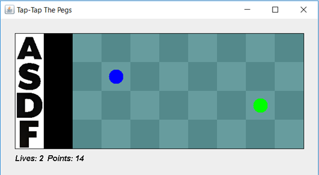

# Tap-Tap-The-Pegs
This is a Java Object Oriented game that has pegs which move across the screen and requires the player to press the key accordingly to each peg when it moves over the black column.

## Gameplay

  

The player selects a song out of the three choices and uses the "A, S, D, F" keys to play. At the start of the game the player is given 3 lives and collects points per each correctly pressed key. As the game progresses, it increases in speed and difficulty. Once the player loses their 3 lives they are prompted to input their name into the scoreboard.

  <image src="game_preview_prompt.png" width=600>

  
